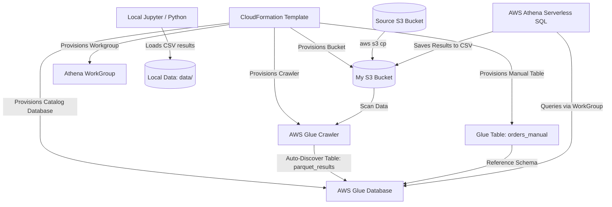

# AWS Athena & Glue with IaC: Performance & Cost Optimization

A project demonstrating building, cataloging, and querying serverless data lakes on AWS using **Infrastructure as Code (IaC)**. This repository contains AWS CloudFormation templates, Glue Database, Crawler, and WorkGroup definitions, alongside local Python analytical notebooks demonstrating the performance and cost benefits of **data partitioning (partition pruning)**.

---

## System Architecture

The following diagram illustrates the flow of data ingestion, schema discovery, serverless querying, and local visualization:



---

## Repository Structure

```
aws-athena-glue-iac/
├── templates/
│   └── athena-glue-infrastructure.yml  # AWS CloudFormation IaC template
├── sql/
│   ├── region_status_revenue_analysis.sql  # Query 1: Unpartitioned whole-table DML
│   └── partitioned_monthly_analysis.sql  # Query 2: Partition-pruned DML (Jan 2023)
├── raw_data/
│   ├── cfn-outputs-final.json          # Deployed stack outputs
│   ├── results_query1.json             # Raw CLI JSON output for Query 1
│   └── results_query2.json             # Raw CLI JSON output for Query 2
├── data/
│   ├── results_query1.csv              # Converted Query 1 CSV data
│   └── results_query2.csv              # Converted Query 2 CSV data
├── notebooks/
│   └── athena_performance_analysis.ipynb # Visualizations & partition efficiency analysis
├── requirements.txt                    # Local Python dependencies
├── .gitignore                          # Git ignore definitions
└── LICENSE                             # MIT License
```

---

## AWS Infrastructure Setup & Querying

This project uses AWS CloudFormation to orchestrate the provisioning of serverless data lake resources.

### 1. Provisioning the AWS Stack
Deploying the CloudFormation stack containing the S3 bucket, Glue database, Glue crawler, Athena workgroup, and a manually defined partitioned Glue catalog table:

```bash
aws cloudformation deploy \
  --stack-name <your-stack-name> \
  --template-file templates/athena-glue-infrastructure.yml \
  --parameter-overrides Alias=<your-unique-alias> \
  --region us-west-2
```

### 2. S3 Data Copy
Copy the sample partitioned Parquet dataset from the source bucket into your newly provisioned S3 bucket (substitute your S3 bucket name from the CloudFormation outputs):

```bash
aws s3 cp s3://<source=bucket-name> \
  s3://<your-s3-bucket-name>/ \
  --recursive \
  --region us-west-2
```

This instruction leads to a large dataset getting loaded into our S3 bucket, on which the following data processing tests are carried out

### 3. Schema Cataloging Options

This project implements and contrast two data cataloging methodologies:

*   **Option A: Auto-Discovery (Glue Crawler)**
    Start the Glue Crawler to automatically scan S3 files, detect columns, create a database table, and partition the data by folders (`year` and `month`):
    ```bash
    aws glue start-crawler --name de-<your-alias>-crawler --region us-west-2
    ```
*   **Option B: Manual Table DDL (CloudFormation-defined)**
    We defined `orders_manual` directly in the CloudFormation template using a static schema definition pointing to S3. To load the partitions, run this repair command in Athena:
    ```sql
    MSCK REPAIR TABLE orders_manual;
    ```

### 4. Running Queries
Execute SQL aggregations via the AWS Athena CLI. The queries count orders, aggregate total revenues, and calculate average values, grouped by region and status:

*   **Query 1 (Unpartitioned - Full Dataset Scan):**
    Defined in [region_status_revenue_analysis.sql](file:///s:/Antigravity%20Workspace/Data%20516%20-%20Cloud%20Computing/aws-athena-glue-iac/sql/region_status_revenue_analysis.sql).
*   **Query 2 (Partitioned - January 2023 Filter):**
    Defined in [partitioned_monthly_analysis.sql](file:///s:/Antigravity%20Workspace/Data%20516%20-%20Cloud%20Computing/aws-athena-glue-iac/sql/partitioned_monthly_analysis.sql).

---

## 📈 Optimization & Cost Analysis

Serverless tools like AWS Athena charge based on data scanned ($5.00/TB). Partition pruning provides significant performance and financial optimization:

| Query Type | Data Scanned (Bytes) | Data Scanned (KB) | Engine Time (ms) | Cost Saving % |
| :--- | :--- | :--- | :--- | :--- |
| **Query 1 (Unpartitioned)** | 7,434,568 | 7,260.32 KB | 1240 ms | Baseline |
| **Query 2 (Partitioned)** | 100,414 | 98.06 KB | 818 ms | **98.65% Cost Reduction** |

*   **Takeaway:** By organizing the data lake directories by `/year=YYYY/month=MM/` and using partition columns in the SQL `WHERE` clause, we restrict Athena to only scan directories that matter, reducing data scanned by **98.65%** and query time by **34%**.

---

## 💻 Local Analysis Setup

To run the query results visualization and data analytics notebook locally:

### Prerequisites
Make sure [uv](https://github.com/astral-sh/uv) (or standard Python 3.10+) is installed.

### Setup Instructions
1.  **Create a Virtual Environment:**
    ```bash
    uv venv --python 3.10
    ```
2.  **Activate the Environment:**
    *   **Windows (PowerShell):**
        ```powershell
        .venv\Scripts\activate
        ```
    *   **macOS / Linux:**
        ```bash
        source .venv/bin/activate
        ```
3.  **Install Requirements:**
    ```bash
    pip install -r requirements.txt
    ```
4.  **Open the Jupyter Notebook:**
    Launch Jupyter Lab/Notebook to view the analysis:
    ```bash
    jupyter notebook notebooks/athena_performance_analysis.ipynb
    ```
